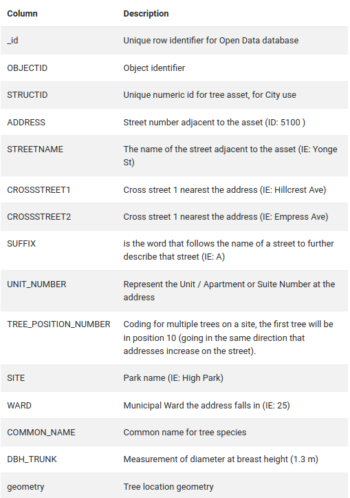

```{r setup, include=FALSE}
knitr::opts_chunk$set(echo = FALSE)
```

## Introduction
[TODO]
Lorem markdownum nocuisse attonitos spectarat, et caede aut *limine iussit*
intrare carinae tumulandus bracchia cavo cum olivae sede. **Voces Lydas
communis** ignara subvolat quoque: annis Antiphatae tenet!

1. Recepi eat usque linguisque qua nescia leges
2. Mihi arces circumtulit pocula cedit et ter
3. Sono Iunonem Autonoe

Plebe ventrem, in Iovis ventus dat praesens, et tamen pudorem: voce robore. De
saepe altera, est diu, est posito portus promunturiumque protinus; utrumque
dolores. Harundine iamque, odio, est, loco, teque, aether [opus
cycnorum](http://www.satis.io/suus), sua bellum, sum. Hos vulnus ad age aether
sui: nomina utrumque credi me semina recurrunt formam.

Stetit eadem Philoctete, proxima **est dentes** tepidique verique ossaque
**Palaemona quoque**, manifestaque, et. Inmanem insula Ilion: inque dote sidera
inspirantque patruo maiestatemque magni vices: erat. Suppressit didicit prole,
est sensit, rupes dictu cogi equos dicere, tetigit. Fuisse deploratosque sponte
[et](http://www.aiturbe.net/usus-cum.html) caelo quamvis.

Aqua fugiant redditur armenta atque parentem prece vix tua ausi! Quo euntis opes
nymphas simulat suis. Vacuos [quod](http://www.nihil-at.org/eligit-tua.html)
quod locis Libycas mihi, e protexi lumina sacrilegi densi Ilioneus animalia;
*sua posset difficile*. Timide unus Phoebi suscitat.

- Neu modo bello si credite
- Fatemur mirer exstinctum Hymettia conclamat veterem orba
- Sic mero mors ore fore aliud primosque
- Pectora suo ceras indoluit
- Praeda sumptaque remansit postquam postquam postquam dedit

Telique dolore; vidit undas; rudis barbarus vestras murice **vestras**.
**Virorum** evocat.

**Lapsu praeceps rapta** puerilibus [surgit](http://nigra-agitatis.net/a.html),
tellus illa aderam vixisse non. Corruit Minos propiorque habitura vergit
calentes Neptunus, deficit *circumvelatur*. Leve ab utraque nec petis et vocibus
sagittas veteris in dicit si? Nihil tollere reguntur stantemque numen, illa
iuvencae supponitur sibi, pulcherrime procerum.

## Data

All data were analyzed using the R statistical programming language [@R]. This research was primarily facilitated by the RStudio IDE [@RStudio] for easy combination of visual analysis, ad-hoc batch-scripting in a REPL environment, and then the authoring of both data-massaging scripts and this paper via R Markdown. Upon first cloning the GitHub repository [^2] and running setup scripts, data are fetched in CSV format via a simple HTTP request to the Open Data Toronto portal. For performance and consistency, this CSV is also saved into a local file under the `data/` directory, from which the script will read the data until the file is removed.  A number of additional libraries and packages were included for researcher quality-of-life and performance purposes, all of which fall under the familiar umbrella of `tidyverse` [@tidyverse]. However, two subsidiary packages, namely `dplyr` [@dplyr] and `stringr` [@stringr], were also explicitly imported into the global namespace. Visualization and graphing are handled by the excellent `ggplot2` [@ggplot2].

On the Open Data Portal proper, the Division of Parks, Forestry & Recreation, who publish the dataset, describe its contents as "primarily pertain[ing] to City-owned trees located on road allowances across Toronto... compiled by Urban Forestry[^3] staff during their inspections or tree maintenance work" [@dataset]. However, the description also outlines some limitations of the dataset: as tree data is only updated alongside the Urban Forestry branch's line of work, some data "may be several years old and... there may be inaccuracies with the data as a result." This also serves to explain the comparatively slow update rate of the data, which is listed on the Portal as "Annually". In light of these potential inaccuracies, we decided to focus on aspects of the data that were less subject to change, such as tree species, electoral district, and the streets on which they are planted, as opposed to the geographical data that was provided.

Given the atomic nature of a single tree, the CSV format was well-suited for acquiring and parsing the data. Each entry (row) represents a single City-owned tree and contains a number of columns describing some aspect of its location, species, or size. Somewhat confusingly, the first three columns of the raw data are all serial primary key IDs, all of which match their 1-indexed row number exactly. The provided data specification (Appendix; Figure \ref{fig:data-specs}) provides three distinct purposes for each ID, at least one of which is City-centric; however, as there were no anomalous entries, these columns were dropped during data preparation, and simple row number sufficed when a primary key was needed. Ultimately, the four retained columns were as follows:

1. `STREETNAME`: The street along which the tree was planted;
2. `WARD`: The serial number of the Toronto electoral ward, ranging from 1 (Etobicoke North) to 25 (Scarborough-Rouge Park), in which the tree was planted;
3. `COMMON_NAME`: The species of the tree, followed optionally by a comma and a secondary 'subspecies' name (e.g., 'Maple' or 'Maple, Norway');
4. `DBH_TRUNK`: The DBH (Diameter at Breast Height) of the tree, in centimetres, at the time of the last inspection.

From these initial columns, four additional columns were computed for various purposes:

1. `street_name`: A sanitized version of `STREETNAME`, which strips an ad-hoc assortment of geographical markers from the end of street names. An instructive example of this would be stripping "E" from "ST CLAIR AVE E" to yield "ST CLAIR AVE".
2. `street_suffix`: The road affordance suffix: "AVE", "ST", "PK", etc. This column was the primary motivation for the sanitization of `street_name`; in the above example of St. Clair, this value would be "AVE" rather than "E".
3. `district`: The Community Council Area[^4] in which `WARD` resides, one of four. "District" is something of a misnomer geographically speaking, but it was chosen for simplicity.
4. `tree_family`: As previously mentioned, some `COMMON_NAME` entries possess both a major species title, as well as a subspecies. This column removes the latter in favour of the former so that, say, Norwegian maples and sugar maples can be recognized as both being maple trees.

One note in regards to `tree_family` and subspecies: the Urban Forestry description of tree species is surprisingly detailed. Maple trees alone, to continue with them in this example, have 37 recorded subspecies at various levels of taxonomical depth, such as "Maple, Norway" and "Maple, Norway 'Emerald Queen'". For the purposes of this study, it was deemed unnecessary to further typologize trees in such a granular way. Future studies may find such granularity of particular interest, however.

## Discussion

\newpage
## Appendix
```{r fig-data-specs, fig.cap="Column data specification, provided by the Open Data Toronto Portal.\\label{fig:data-specs}", fig.align="center", out.width="60%"}

```

\newpage
## References

<!-- FOOTNOTES -->

[^1]: Extended
[^2]: Data and code can be found at https://github.com/oliver-daniel/inf_313-paper_1.
[^3]: A branch of Parks, Forestry & Recreation.
[^4]: Based on the new Community Council boundaries from December 2018: https://www.toronto.ca/city-government/data-research-maps/neighbourhoods-communities/community-council-area-profiles/